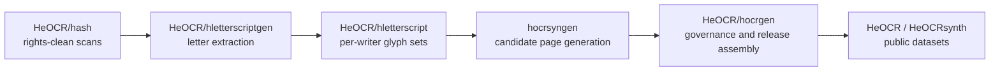

# hocrsyngen

[](https://github.com/HeOCR/hocrsyngen/actions/workflows/ci.yml)


Created by [Shay Palachy Affek](http://www.shaypalachy.com/).

Synthetic Hebrew OCR/HTR sample generator for the HeOCR ecosystem. It creates
deterministic candidate page batches with Hebrew RTL metadata, manifest
validation, packaged fonts, and candidate-only governance boundaries.


## At a Glance

| Field | Value |
| --- | --- |
| Role | Deterministic candidate synthetic Hebrew OCR/HTR page generation |
| Main output | `generation_manifest.json` plus relative JPEG page assets |
| Manifest contract | [`docs/generation_manifest_v1.md`](docs/generation_manifest_v1.md) |
| Packaged fixture | `generation_manifest_v1_fixture_batch` |
| Downstream owner | [`HeOCR/hocrgen`](https://github.com/HeOCR/hocrgen) |
| Release status | Candidate input only; not a release-ready dataset payload |
| Runtime boundary | No REST, GPU, LLM, diffusion, or network dependency in the baseline |

## What This Repository Owns

This package owns deterministic candidate synthetic sample generation.
[`hocrgen`](https://github.com/HeOCR/hocrgen) remains responsible for dataset
orchestration, governance, review, validation, release assembly, and export to
`HeOCR` and `HeOCRsynth`.

## HeOCR Ecosystem Position



`hocrsyngen` is the page-composition step of the HeOCR pipeline, sitting
downstream of the real-glyph chain and upstream of `hocrgen` and the public
dataset releases. See [docs/repository_scope.md](docs/repository_scope.md) for
the full six-repo ecosystem table, ownership boundaries, and the planned Phase
S9 real-glyph composition work.

## Scope

- Generate governed synthetic Hebrew OCR/HTR fixture batches.
- Emit `generation_manifest.json` with relative page assets.
- Preserve logical-order UTF-8 Hebrew text with RTL metadata.
- Keep the baseline package free of REST, GPU, LLM, diffusion, and network
  dependencies.

Generated directories are deterministic candidate synthetic inputs for later
`hocrgen` governance. They are not release-ready dataset payloads by themselves.

## Project Documentation

- [Documentation index](docs/README.md)
- [Repository scope](docs/repository_scope.md)
- [Architecture](docs/architecture.md)
- [generation_manifest.json v1](docs/generation_manifest_v1.md)
- [hocrgen integration](docs/hocrgen_integration.md)
- [Production readiness](docs/production_readiness.md)
- [Roadmap](docs/roadmap.md)
- [Research program](docs/research_program.md)
- [Handwriting research acceptance criteria](docs/handwriting_research_acceptance_criteria.md)
- [Allograph and character-level prototype plan](docs/allograph_character_prototype_plan.md)
- [Word and line assembly prototype plan](docs/word_line_assembly_prototype_plan.md)
- [Learned generation packaging boundary](docs/learned_generation_packaging_boundary.md)
- [Downstream realism acceptance rubric](docs/downstream_realism_acceptance_rubric.md)
- [Downstream utility measurement contract](docs/downstream_utility_measurement_contract.md)
- [Synthetic diversity and domain-shift metrics](docs/synthetic_diversity_domain_shift_metrics.md)
- [Release cap handoff policy](docs/release_cap_handoff_policy.md)
- [Review evidence sidecar contract](docs/review_evidence_sidecar_contract.md)
- [Candidate batch profile and mix handoff](docs/candidate_batch_profile_mix_handoff.md)
- [hocrgen adapter handoff checklist](docs/hocrgen_adapter_handoff_checklist.md)
- [Script abstraction design](docs/script_abstraction_design.md)
- [Wet-testing program plan](docs/wet_testing_program_plan.md)
- [Real-glyph composition plan](docs/real_glyph_composition_plan.md)
- [Testing and quality](docs/testing_and_quality.md)

## CLI

```bash
hocrsyngen templates
hocrsyngen templates --format json
hocrsyngen templates --format json --catalog-version v2
hocrsyngen generate --count 2 --seed 17 --output out/fixture-batch
hocrsyngen generate --count 2 --seed 17 --output out/fixture-batch --format json
hocrsyngen generate --count 2 --seed 17 --output out/fixture-batch --rendering-coverage-report
hocrsyngen validate out/fixture-batch
hocrsyngen validate out/fixture-batch --format json
hocrsyngen wet-run --profile smoke --seed 17 --output out/wet-tests/smoke-17 --format json
hocrsyngen wet-gallery out/wet-tests/smoke-17 --output out/wet-tests/smoke-17/gallery
hocrsyngen wet-analyze out/wet-tests/smoke-17 --format json
hocrsyngen wet-review-template out/wet-tests/smoke-17 --output out/wet-tests/smoke-17/review/human_review.csv --format json
hocrsyngen wet-review-validate out/wet-tests/smoke-17 out/wet-tests/smoke-17/review/human_review.csv --format json
hocrsyngen wet-llm-packet out/wet-tests/smoke-17 --output out/wet-tests/smoke-17/review/llm_packet --format json
hocrsyngen wet-report out/wet-tests/smoke-17 --format json
hocrsyngen evidence-run --count 20 --seed 101
```

`hocrsyngen templates` prints one deterministic catalog line per packaged
synthetic template, including the template id, recipe id, layout style, font
style, resolved packaged font id, and degradation preset.

Text output remains the default for human-facing CLI use. `hocrsyngen templates
--format json` emits the same governed template catalog as deterministic
machine-readable metadata for orchestration code that should not import
`hocrsyngen` internals. This abbreviated example shows the shape of the
machine-readable catalog:

```json
{
  "schema_version": "template_catalog.v1",
  "templates": [
    {
      "template_id": "printed_letter",
      "recipe_id": "printed_letter_form_v1",
      "layout_style": "printed_form",
      "font_style": "printed",
      "font_id": "alef-regular",
      "degradation_preset": "office_scan_soft"
    },
    {
      "template_id": "handwritten_note",
      "recipe_id": "handwritten_note_marginalia_v1",
      "layout_style": "handwritten_note",
      "font_style": "handwritten_like",
      "font_id": "gveret-levin-regular",
      "degradation_preset": "notebook_scan_worn"
    }
  ]
}
```

The JSON catalog is package metadata only. It does not change manifest v1 and
does not assemble, validate, export, or publish release payloads; those remain
`hocrgen` responsibilities.

`hocrsyngen templates --format json --catalog-version v2` emits the versioned
`template_catalog.v2` surface. The normative schema is
`src/hocrsyngen/schemas/template_catalog.schema.json`. The v2 catalog preserves
the v1 join keys and adds
`document_family`, `base_family`, `page_regions`, `annotation_types`,
`identifier_types`, `layout_density`, and `review_features` so downstream tools
can join validated manifest `template_id` and `recipe_id` provenance to richer
catalog metadata without importing private recipe internals. Manifest v1 remains
unchanged. The v2 catalog is JSON-only; `--catalog-version v2` must be used with
`--format json`.

The current `hocrsyngen` baseline is ready to generate validated candidate
synthetic batches with the governed document families added through S3f, while
S5 closed by deferral after defining acceptance gates plus docs-first allograph,
word/line assembly, and learned-generation packaging boundaries for future
handwriting research. S6 is complete through downstream evaluation and
acceptance handoff planning: S6a documents the downstream realism acceptance
rubric, and S6b defines the
downstream utility measurement contract that keeps CER/WER claims gated on real
references, ground truth, split/leakage controls, and synthetic-to-real
comparison in `hocrgen`/HeOCR. S6c defines synthetic diversity and domain-shift
metric boundaries for detecting repeated candidate-batch patterns,
over-representation, and downstream synthetic-to-real comparison gaps. S6d
defines how public `hocrsyngen` metadata and S6a/S6b/S6c evidence support
downstream release cap decisions without moving caps, source composition,
release eligibility, export, publication, or governance enforcement into this
repository. S6e defines a portable optional downstream review evidence sidecar
for reviewed sample/page ids, reviewer observations, visual evidence references,
S6a category references, S6c warning references, S6d cap decision references,
limitations, and unreviewed strata outside `generation_manifest.json` v1.
S6f defines an optional downstream candidate batch profile and mix handoff for
requested, generated/observed, reviewed, capped/admitted, and released candidate
mix layers outside manifest v1. S6g defines an external downstream `hocrgen`
adapter checklist for installed CLI import, validation, public catalog joins,
id retention, optional S6a-S6f evidence links, failure handling, and governance
boundaries without adding adapter behavior to this repository.
S7a defines the minimal design-only script abstraction boundary for future
RTL-script profiles. It preserves Hebrew-first behavior and current Hebrew
RTL/NFC, manifest v1, and validation guarantees; it does not implement Arabic
support or change generator, CLI, schema, fixture, validation, or integration
behavior.
S8a defines the developer-owned wet-testing program for generator-quality
evidence. S8b adds a deterministic wet-test smoke run artifact generator, S8c
adds the candidate evidence-run wrapper for downstream preflight evidence, S8d
adds the human-first static gallery over existing wet-test runs, S8e adds
deterministic warning metrics over wet-test runs, and S8f adds the human
review worksheet template and validator over existing wet-test runs without
adding release governance, baseline LLM/network dependencies, schemas, or
manifest v1 changes.
Readiness for public dataset use still depends on downstream `hocrgen` import
governance, review, caps, dedupe, release assembly, export, and publication
policy.

Text output remains the default generation behavior for human-facing CLI use;
successful generation does not print a report unless requested.
`hocrsyngen generate --count N --seed S --output PATH --format json` writes the
same deterministic batch and emits a deterministic machine-readable generation
report to stdout:

```json
{
  "schema_version": "generation_report.v1",
  "sample_count": 2,
  "page_count": 2,
  "output_path": "out/fixture-batch",
  "manifest_path": "out/fixture-batch/generation_manifest.json"
}
```

The generation report is CLI output only. It does not add manifest fields or
change manifest v1 compatibility.

`hocrsyngen evidence-run --count N --seed S` is the single-command operator
wrapper for downstream preflight evidence. It prints colored progress logs to
stderr, exports and validates the packaged contract fixture, captures template
and contract JSON reports, generates and validates a candidate batch, writes the
optional rendering coverage sidecar, records a checksum inventory, and emits a
final `candidate_evidence_run_report.v1`. The default output root is a
timestamped directory under the system temp directory; use `--output-root PATH`
and `--run-id ID` to make the location explicit. Evidence runs remain
candidate-only and write `release_eligible: false`; they do not add review,
release, export, publication, or downstream governance behavior.

`hocrsyngen wet-gallery RUN_ROOT --output RUN_ROOT/gallery` renders a static
HTML gallery for an existing passed `wet-run` directory. It validates each
referenced batch, writes `gallery/index.html`, links to generated page images
with relative paths, and shows public metadata for sample id, page id, template
id, recipe id, style/persona, condition, degradation, font id, asset path, and
logical-order Hebrew manifest text. The gallery is an offline human-inspection
aid only; it does not add review sidecars, LLM triage packets, wet-test
reports, schemas, release eligibility, export, publication, or downstream
governance behavior.

`hocrsyngen wet-analyze RUN_ROOT --format json` emits deterministic
`wet_analysis_report.v1` generator-quality metrics for an existing passed
`wet-run` directory. It validates referenced batches, computes coverage,
duplicate text and repeated id/hash warnings, asset dimensions, blank/near-blank
image smoke, ink-density ranges, `template_catalog.v2` join completeness, and
path/hash safety summaries. Hard blockers such as invalid batches, hash
mismatches, unreadable images, or unsafe paths stay separate from warnings. The
report is source-backed local analysis only; it does not claim realism
acceptance, OCR/HTR utility, domain match, release readiness, export,
publication, or downstream governance behavior.

`hocrsyngen wet-review-template RUN_ROOT --output RUN_ROOT/review/human_review.csv`
writes a deterministic human-review worksheet for an existing passed `wet-run`
directory. It validates each referenced batch, enumerates every sample/page
from the validated manifests, and pre-fills the manifest-derived columns so
reviewers only have to record their identifier, decision, severity, reason
codes, notes, and regression-fixture flag. The canonical column list is
`REVIEW_FIELDS` in `src/hocrsyngen/wet_review.py`. Default output is CSV; JSON
Lines is also supported via `--review-format jsonl`. The summary report is
`wet_review_template_report.v1`. The command is a human-evidence aid only; it
does not change `generation_manifest.json` v1 and does not claim realism
acceptance, OCR/HTR utility, release readiness, export, publication, or
downstream governance behavior.

CSV worksheets carry `reason_codes` as a comma-separated string (the CSV
writer quotes the field automatically when it contains a comma). JSON Lines
worksheets carry `reason_codes` as a JSON array. The output path must be
inside the wet-test run directory and must use a `.csv`, `.jsonl`, or
`.ndjson` extension.

`hocrsyngen wet-review-validate RUN_ROOT REVIEW_PATH --format json` validates
a completed CSV/JSONL review worksheet against a passed `wet-run` directory.
The review file must be inside the wet-test run directory. The validator
checks that every row matches a manifest-derived sample/page id, that every
reviewed row uses one of the documented decision states
(`pass`/`hold`/`reject`), severity levels (`P0`/`P1`/`P2`/`info`), and reason
codes from the wet-testing program plan, that every `hold` or `reject` row
carries severity, reason codes, and a reviewer identifier, and that no row
records a reviewer without a decision. The summary report is
`wet_review_validation_report.v1`; the command exits non-zero on any error
and does not modify any wet-run artifact.

`hocrsyngen wet-llm-packet RUN_ROOT --output RUN_ROOT/review/llm_packet` exports
a bounded LLM triage packet for an existing passed `wet-run` directory. It writes
`llm_triage_prompt.md` (a Markdown prompt for operator-run LLM advisory review)
and `llm_triage_packet.json` (structured metadata with sample ids, asset paths,
run metadata, and analysis warning summary if available). The `--max-samples N`
flag caps the prompt to N samples (default: 20) to keep the packet bounded. The
`--format json` flag emits a `llm_triage_packet_report.v1` summary to stdout. The
output directory must be inside the wet-test run directory. The command is
advisory only — it does not call any LLM API, does not require network access,
does not make pass/fail or release-eligibility claims, and does not modify any
wet-run artifact or manifest.

`hocrsyngen generate --rendering-coverage-report` writes an opt-in
`rendering_coverage_report.json` sidecar beside the manifest. The sidecar uses
report version `rendering_coverage_report.v1` and summarizes covered and missing
Hebrew rendering dimensions for the generated batch, including governed fonts,
templates, recipes, degradation presets, text features, mixed-direction
evidence, RTL rendering path evidence, environment status, and page asset smoke
checks. It is coverage evidence outside manifest v1, not review, release,
export, or publication metadata. `hocrsyngen validate` does not require or
inspect the sidecar.

The command writes:

```text
out/fixture-batch/
  generation_manifest.json
  rendering_coverage_report.json  # only with --rendering-coverage-report
  assets/
    hocrsyngen-s00000017-000000/page_0001.jpg
    hocrsyngen-s00000017-000001/page_0001.jpg
```

Manifest v1 includes stable sample ids, relative image paths, logical-order
Hebrew text, script/language/direction metadata, generator version, recipe id,
seed/template/recipe/degradation/font provenance, `PROJECT-SYNTHETIC` licensing,
synthetic disclosure, and a required controls object with nullable
persona/condition values only. The governed template contract is enforced
through the existing `sample.recipe_id`, `sample.provenance.template_id`,
`sample.provenance.recipe_id`, `sample.provenance.degradation_preset`, and
`sample.provenance.font_id` fields; no extra manifest fields are required.

`hocrsyngen generate --persona STYLE_ID` selects a deterministic synthetic style
bundle and writes the selected id to `controls.persona`. Supported S4b style ids
are `style_standard_v1`, `style_open_drift_v1`, and
`style_compact_steady_v1`. These are neutral generator controls for rendering
parameters such as spacing, baseline drift, horizontal variance, and ink
pressure proxy; they are not identity, authorship, provenance, medical,
psychological, disability, demographic, review, release, or publication
metadata.

`hocrsyngen generate --condition CONDITION_ID` selects a deterministic synthetic
rendering-control condition bundle and writes the selected id to
`controls.condition`. Supported S4c condition ids are `condition_standard_v1`,
`condition_low_contrast_v1`, and `condition_dense_spacing_v1`. These ids describe
neutral rendering adjustments such as scan contrast, blur, brightness, and body
text line-spacing density. Dense spacing tightens rendered body text line
placement only; it does not rescale template guide lines, form rows, archive
card grids, stamps, marginalia, or other scaffolding. These ids are not
identity, authorship, provenance, medical, psychological, disability,
demographic, review, release, or publication metadata, and they do not add a
`condition` object or richer manifest v1 metadata.

`hocrsyngen validate PATH` checks `PATH/generation_manifest.json` against the
packaged manifest schema, verifies v1 constants and Hebrew RTL metadata,
verifies top-level constants (`manifest_version`, `generator_name`, `license`,
and `synthetic_disclosure`), verifies sample-level constants (`license`,
`synthetic_disclosure`, and `generator_version`), confirms each sample's
recipe/provenance fields match a governed packaged template contract, confirms
referenced page assets are portable paths under `PATH`, recomputes asset SHA-256
values, and verifies JPEG dimensions match the manifest. The command is
read-only and returns a non-zero exit code with deterministic errors when a
generated batch is invalid.

Text output remains the default validation report for human-facing CLI use.
`hocrsyngen validate PATH --format json` emits a deterministic
machine-readable validation report to stdout without changing manifest v1. The
`path` field echoes the original CLI argument string, not a resolved canonical
filesystem path:

```json
{
  "schema_version": "validation_report.v1",
  "valid": true,
  "sample_count": 2,
  "page_count": 2,
  "path": "out/fixture-batch"
}
```

`hocrsyngen wet-run --profile smoke --seed 17 --output out/wet-tests/smoke-17`
creates the first S8 wet-test artifact directory for developer-owned
generator-quality evidence. The smoke profile uses the existing generator to
create one sample for each governed template, validates the generated `batch/`
directory with the existing validator, and also generates one supplemental
non-default style/condition sample under
`control_batches/non_default_style_condition/`. It retains public reports under
`reports/` and writes `reports/wet_test_run.json` plus
`reports/wet_test_checksums.txt`. Successful runs are published atomically from
a temporary sibling directory; failed runs write a structured failed
`wet_test_run.json` when possible. The run artifact is not a release-ready
dataset payload and does not change `generation_manifest.json` v1.

Invalid batches keep the non-zero validation exit code and emit a deterministic
JSON error report to stdout when JSON output is requested. Validation errors
encoded in JSON leave stderr empty:

```json
{
  "schema_version": "validation_report.v1",
  "valid": false,
  "path": "out/fixture-batch",
  "error": "Missing manifest: out/fixture-batch/generation_manifest.json"
}
```

The governed template contract currently packaged with `hocrsyngen` is:

| Template id | Recipe id | Degradation preset | Recipe font style | Packaged font id |
| --- | --- | --- | --- | --- |
| `printed_letter` | `printed_letter_form_v1` | `office_scan_soft` | `printed` | `alef-regular` |
| `handwritten_note` | `handwritten_note_marginalia_v1` | `notebook_scan_worn` | `handwritten_like` | `gveret-levin-regular` |
| `archive_card` | `archive_card_identifier_v1` | `office_scan_soft` | `printed` | `alef-regular` |
| `ledger` | `ledger_table_v1` | `office_scan_soft` | `printed` | `alef-regular` |
| `printed_letter_heavy_scan` | `printed_letter_form_heavy_scan_v1` | `office_scan_heavy` | `printed` | `alef-regular` |
| `handwritten_note_heavy_wear` | `handwritten_note_marginalia_heavy_wear_v1` | `notebook_scan_heavy_wear` | `handwritten_like` | `gveret-levin-regular` |
| `archive_card_faded_scan` | `archive_card_identifier_faded_scan_v1` | `archive_scan_faded` | `printed` | `alef-regular` |

The packaged font id is resolved from the packaged default
`data/synthetic/fonts/manifest.yaml` by matching each governed recipe's font
style. Validation is anchored to this default governed catalog; custom Python
API generation inputs are outside the packaged validation contract.

Validation rejects a manifest when `provenance.template_id` is not one of the
packaged governed templates, when the sample-level `recipe_id` differs from
`provenance.recipe_id`, or when the provenance recipe, degradation preset, or
font id does not match the packaged contract for that template.

## Contract Fixture for hocrgen Integration

`hocrsyngen` packages a canonical generated batch fixture at:

```text
src/hocrsyngen/data/contracts/generation_manifest_v1/fixture-batch/
```

From a source checkout, reproduce the current fixture with:

```bash
PYTHONPATH=src python -m hocrsyngen.cli generate --count 2 --seed 17 --output src/hocrsyngen/data/contracts/generation_manifest_v1/fixture-batch
```

Downstream packages should discover and export this packaged fixture through the
installed `hocrsyngen` CLI instead of importing `hocrsyngen` internals:

```bash
hocrsyngen contracts
hocrsyngen contracts --format json
hocrsyngen contracts export --fixture-id generation_manifest_v1_fixture_batch --output out/fixture-batch
hocrsyngen contracts export --fixture-id generation_manifest_v1_fixture_batch --output out/fixture-batch --format json
```

The current contract fixture id is
`generation_manifest_v1_fixture_batch`. `hocrsyngen contracts --format json`
emits a deterministic package fixture catalog:

```json
{
  "schema_version": "contract_fixture_catalog.v1",
  "fixtures": [
    {
      "fixture_id": "generation_manifest_v1_fixture_batch",
      "contract": "generation_manifest.v1",
      "sample_count": 2,
      "page_count": 2,
      "resource_path": "data/contracts/generation_manifest_v1/fixture-batch",
      "manifest_resource_path": "data/contracts/generation_manifest_v1/fixture-batch/generation_manifest.json"
    }
  ]
}
```

`hocrsyngen contracts export --fixture-id generation_manifest_v1_fixture_batch
--output PATH --format json` copies the packaged fixture batch to a normal
filesystem directory, validates the exported batch with `validate_batch()`, and
emits a deterministic machine-readable export report:

```json
{
  "schema_version": "contract_fixture_export.v1",
  "fixture_id": "generation_manifest_v1_fixture_batch",
  "contract": "generation_manifest.v1",
  "sample_count": 2,
  "page_count": 2,
  "output_path": "out/fixture-batch",
  "manifest_path": "out/fixture-batch/generation_manifest.json"
}
```

This CLI/package boundary gives `hocrgen` a stable installed-package contract
without depending on private module names, resource layout helpers, or Python
objects inside `hocrsyngen`.

It contains `generation_manifest.json` v1 plus relative JPEG page assets for
two stable fixture samples, currently covering `printed_letter` and
`handwritten_note`. The fixture is contract evidence for downstream `hocrgen`
adapter tests and is candidate synthetic input only; it is not release-ready
dataset data. `hocrgen` should ingest or validate the fixture manifest,
preserve the relative asset contract, and then apply its own governance,
privacy, review, dedupe, split, cap, benchmark, release, and export gates.

## Development

```bash
python -m pip install -e ".[test]"
python -m pytest
```

The GitHub Actions CI workflow runs the test suite, required CLI smoke commands,
Pillow libraqm checks for Hebrew RTL rendering, and package build/install checks
on Ubuntu and macOS for Python 3.11 and 3.12.

See `docs/testing_and_quality.md` for the canonical Python support policy.

## Credits

Created by [Shay Palachy Affek ](http://www.shaypalachy.com/) [[GitHub](https://github.com/shaypal5)]
